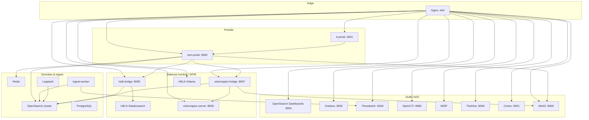
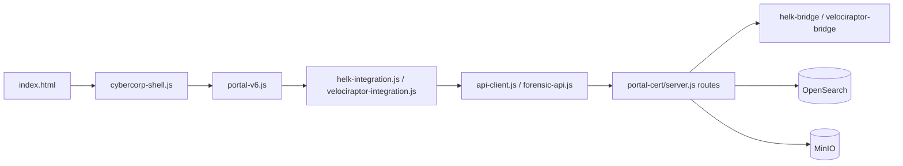

# Architecture — Plateforme FP-Master

## Vue globale

## Routage Nginx

Fichier principal : [`config/nginx/conf.d/forensic.conf`](../../config/nginx/conf.d/forensic.conf)

| Chemin | Upstream | Rôle |
|--------|----------|------|
| `/` | `cert-portal:3000` | Portail CERT |
| `/it/` | `it-portal:3001` | Portail IT |
| `/dashboards` | `opensearch-dashboards:5601` | OpenSearch Dashboards |
| `/grafana/` | `grafana:3000` | Grafana |
| `/timesketch/` | `timesketch-web:5000` | Timesketch SPA |
| `/api/v1/`, `/sketch/` | Timesketch | API absolues Timesketch |
| `/cti/` | `opencti:8080` | OpenCTI |
| `/thehive/` | `thehive:9000` | TheHive |
| `/misp/` | `misp` | MISP |
| `/cortex/` | `cortex:9001` | Cortex |
| `/minio/` | `minio:9001` | Console MinIO |
| `/helk/kibana/` | `helk-kibana:5601` | Kibana HELK |
| `/helk/api/` | `helk-elasticsearch:9200` | API ES HELK |
| `/velociraptor/` | `velociraptor-server:8000` | GUI Velociraptor |
| `/velociraptor/api/*` | `velociraptor-bridge:8097` | Bridge export/collecte |
| `/opensearch/` | redirect → `/dashboards/` | Alias historique |

Snippets : [`config/nginx/snippets/grafana-proxy.conf`](../../config/nginx/snippets/grafana-proxy.conf), [`misp-root-paths.conf`](../../config/nginx/snippets/misp-root-paths.conf).

## Services Docker clés

Fichier : [`docker-compose.yml`](../../docker-compose.yml)

| Service | Image / build | Réseau |
|---------|---------------|--------|
| `cert-portal` | `portal-cert/Dockerfile` | `forensic-net` |
| `it-portal` | `portal-it/Dockerfile` | `forensic-net` |
| `nginx` | `nginx:1.25-alpine` | `forensic-net`, `helk_net`, `velociraptor_net` |
| `opensearch-node1/2` | OpenSearch | `forensic-net` |
| `opensearch-dashboards` | OSD | `forensic-net` |
| `ingest-worker` | Python worker | `forensic-net` |
| `logstash` | Logstash FP | `forensic-net` |
| `timesketch-web` | Timesketch | `forensic-net` |
| `grafana` | Grafana | `forensic-net` |
| `opencti` + connecteurs | OpenCTI stack | `forensic-net` |
| `helk-bridge` | `./helk/scripts` | `helk_net`, `forensic-net` |
| `velociraptor-bridge` | `velociraptor/export` | `velociraptor_net`, `forensic-net` |

Sidecar Velociraptor : [`velociraptor/docker-compose.velociraptor.yml`](../../velociraptor/docker-compose.velociraptor.yml).

## Couches applicatives portail

## Indices OpenSearch principaux

| Préfixe | Usage |
|---------|-------|
| `forensic-uploads*` | Métadonnées uploads CERT/IT |
| `forensic-tokens*` | Tokens IT actifs |
| `forensic-portal-*` | Incidents, tickets, KB, assets (master) |
| `fp-*` | Parsing, CTI, playbooks |
| `helk-*` | Findings, hunts, détections Sigma (sync bridge) |
| `velociraptor-*` | Collections DFIR exportées |

## Sécurité edge

- TLS terminé sur Nginx (`config/nginx/certs/`)
- Headers : `Strict-Transport-Security`, `X-Content-Type-Options`
- Auth portail : session JWT (`portal-cert/lib/auth-*.js`)
- Portail IT : validation token avant upload (`portal-it/server.js`)
