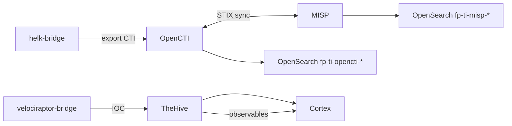

# CTI — Cyber Threat Intelligence

Stack CTI intégrée : OpenCTI (knowledge graph), MISP (partage IOC), TheHive (cas IR), Cortex (analyseurs).

## Accès

| Outil | URL nginx | Rôle |
|-------|-----------|------|
| OpenCTI | `https://<IP>/cti/` | STIX, knowledge graph, connecteurs |
| MISP | `https://<IP>/misp/` | Partage IOC, événements |
| TheHive | `https://<IP>/thehive/` | Gestion cas IR, observables |
| Cortex | `https://<IP>/cortex/` | Analyseurs et responders |

Liens topbar portail CERT : **🧠 OpenCTI**, **🔴 MISP**, **🐝 TheHive**, **🧬 Cortex**.

## Configuration

| Fichier | Rôle |
|---------|------|
| `docker-compose.opencti.yml` | Connecteurs OpenCTI (MITRE, CVE, ThreatFox, etc.) |
| `config/opencti/ti-turbo.env` | Variables OpenCTI |
| `config/opencti/fp_master_sample.stix.json` | STIX sample |
| `config/thehive/application.conf` | Config TheHive |
| `config/cortex/application.conf` | Config Cortex |
| `scripts/thehive-init.sh` | Initialisation TheHive |
| `config/nginx/snippets/misp-root-paths.conf` | Chemins absolus MISP |

## Connecteurs OpenCTI (exemples)

Définis dans `docker-compose.opencti.yml` :

- `connector-mitre` — MITRE ATT&CK
- `connector-cve` — CVE feeds
- `connector-opencti-datasets` — Datasets officiels
- Connecteurs tiers : AbuseIPDB, AlienVault, MalwareBazaar, URLhaus, CISA KEV, Shodan, ThreatFox…

## Flux CTI



## Export IOC depuis HELK

| Action | Route |
|--------|-------|
| Export IOC → CTI/IR | `POST /api/helk/export-cti` |

Bridge pousse les IOC détectés vers OpenCTI / corrélation MISP.

## Enrichissement on ingest

[`ingest-worker/ti_enrichment.py`](../../ingest-worker/ti_enrichment.py) enrichit les documents forensic avec contexte CTI lors de l'indexation OpenSearch.

## Webhook TheHive

`POST /api/webhook/thehive` — notifications cas depuis TheHive vers portail CERT (audit, corrélation).

Fichier : [`portal-cert/server.js`](../../portal-cert/server.js).

## Panneau CTI portail

Onglet **Renseignement menace (CTI)** :

- Synthèse IOC (OpenCTI + MISP)
- Statut connecteurs
- Volume événements SIEM
- Liens directs outils

## Indices OpenSearch CTI

| Pattern | Source |
|---------|--------|
| `fp-ti-opencti-*` | Sync OpenCTI |
| `fp-ti-misp-*` | Sync MISP |

Script sync : `scripts/opensearch_ioc_misp_sync.py`.

## Tests

```bash
cd tests && BASE_URL=https://<IP> npx playwright test ui-cti.spec.ts ui-misp.spec.ts ui-thehive.spec.ts ui-cortex.spec.ts
```
