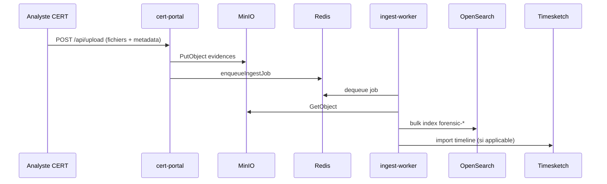
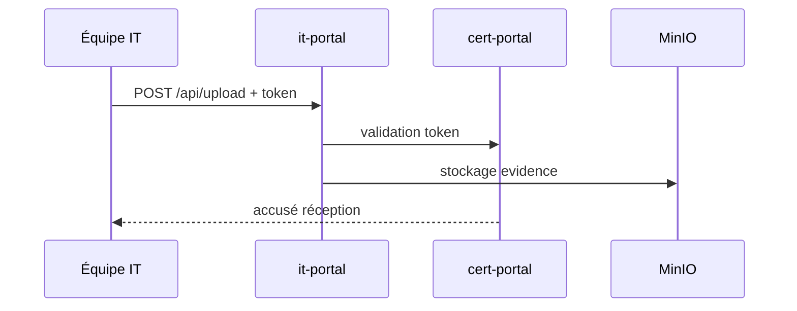
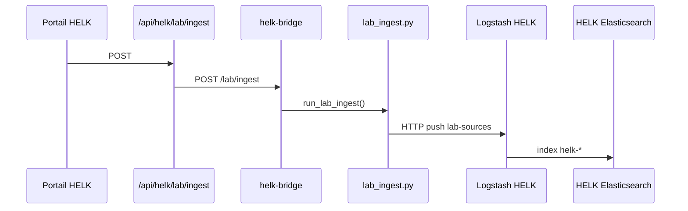
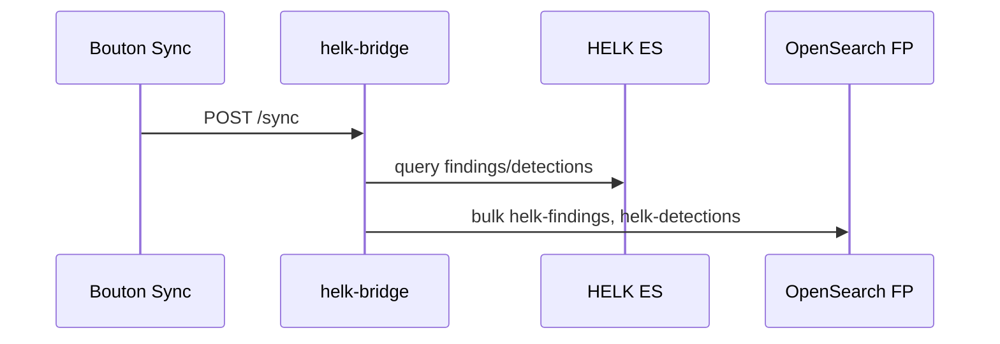
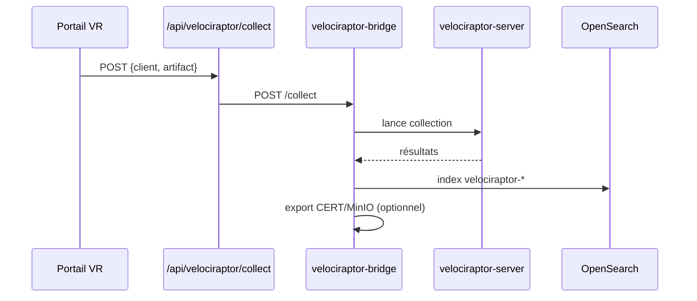

# Flux de données

## 1. Upload CERT → OpenSearch + Timesketch

Fichiers : [`portal-cert/server.js`](../../portal-cert/server.js), [`lib/ingest-queue.js`](../../lib/ingest-queue.js), [`ingest-worker/worker.py`](../../ingest-worker/worker.py).

## 2. Upload IT (token) → CERT

## 3. Ingest HELK lab (offline)

Fichiers : `helk/scripts/lab_ingest.py`, [`portal-shared/js/helk-integration.js`](../../portal-shared/js/helk-integration.js).

## 4. Sync HELK → OpenSearch FP

## 5. Export HELK → Timesketch / CTI

| Action | Route portail | Bridge | Cible |
|--------|---------------|--------|-------|
| Timeline | `POST /api/helk/export-timesketch` | `/export/timesketch` | Sketch Timesketch |
| IOC | `POST /api/helk/export-cti` | `/export/cti` | OpenCTI / MISP |

## 6. Collecte Velociraptor

## 7. Collecte offline (lab sans agent)

| Bouton UI | Route | Bridge |
|-----------|-------|--------|
| Collecte DFIR complète | `POST /api/velociraptor/lab/collect-full` | `/lab/collect-full` |
| Playbook offline | `POST /api/velociraptor/lab/collect` | `/lab/collect` |

Simulateur : [`velociraptor/export/lab_simulator.py`](../../velociraptor/export/lab_simulator.py).

## 8. Push ingest → HELK (hunting)

Lors d'un upload CERT avec option « Envoyer vers HELK » :

1. `pushToHelk()` dans [`lib/helk-connector.js`](../../lib/helk-connector.js)
2. HTTP POST vers Logstash HELK (`HELK_LOGSTASH_URL`)
3. Pipeline 0000-input-http-lab → pipelines thématiques

## 9. CTI enrichment on ingest

`ingest-worker/ti_enrichment.py` enrichit les documents avec IOC OpenCTI/MISP lors de l'indexation.

## 10. Webhook TheHive

`POST /api/webhook/thehive` — notifications cas IR vers portail (audit / corrélation).
