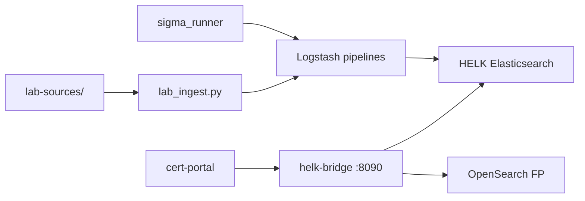

# HELK — Hunting & ELK

Stack sidecar **HELK** pour hunting Sysmon, Windows EVTX, Linux auth/syslog, Zeek, enrichissement MITRE et détections Sigma.

## Accès

| Interface | URL |
|-----------|-----|
| Panneau portail | CERT → **HELK Hunting** |
| Kibana HELK | `https://<IP>/helk/kibana/` |
| API bridge (nginx) | `/helk/api/` → Elasticsearch HELK |
| Grafana dashboards | `/grafana/d/helk-*` |

## Architecture



## Fichiers clés

| Chemin | Rôle |
|--------|------|
| `helk/scripts/helk_bridge.py` | Bridge HTTP |
| `helk/scripts/lab_ingest.py` | Ingest lab offline |
| `helk/scripts/sigma_runner.py` | Runner Sigma |
| `helk/config/logstash/pipeline/` | Pipelines 0010–0099 |
| `helk/lab-sources/` | Données lab Sysmon, Zeek, etc. |
| `portal-cert/routes/helk-routes.js` | Routes portail |
| `portal-shared/js/helk-integration.js` | UI panneau |
| `dashboards/grafana/helk/*.json` | Dashboards Grafana |

## Pipelines Logstash

| Pipeline | Fichier | Source |
|----------|---------|--------|
| Input lab HTTP | `0000-input-http-lab.conf` | Upload portail / lab_ingest |
| Sysmon | `0010-sysmon.conf` | Events Sysmon JSON |
| Windows EVTX | `0020-windows-evtx.conf` | EVTX parsés |
| Linux auth | `0030-linux-auth.conf` | auth.log |
| Linux syslog | `0040-linux-syslog.conf` | syslog |
| Zeek | `0050-zeek.conf` | conn.log, dns.log |
| ECS norm | `0060-ecs-normalization.conf` | Normalisation |
| MITRE | `0070-mitre-enrichment.conf` | Tags MITRE ATT&CK |
| Sigma | `0080-sigma-detections.conf` | Alertes Sigma |
| Output ES | `0099-output-elasticsearch.conf` | Index helk-* |

## Indices

| Pattern | Contenu |
|---------|---------|
| `helk-sysmon-*` | Events Sysmon |
| `helk-linux-*` | Logs Linux |
| `helk-zeek-*` | Zeek network |
| `helk-findings` | Findings sync vers FP |
| `helk-detections` | Détections Sigma |
| `helk-hunts` | Hunts enregistrés |

## Actions portail

| Bouton | API | Effet |
|--------|-----|-------|
| Envoyer vers HELK | `POST /api/helk/lab/ingest` | Charge lab-sources |
| Sync findings → OpenSearch | `POST /api/helk/sync` | Copie findings vers FP |
| Export timeline Timesketch | `POST /api/helk/export-timesketch` | Crée/met à jour sketch |
| Export IOC → CTI/IR | `POST /api/helk/export-cti` | Push IOC vers CTI |
| Vue hunting HELK | Lien Grafana | Dashboard overview |

## Dashboards Grafana

| Fichier | UID |
|---------|-----|
| `helk-overview.json` | `helk-overview` |
| `helk-detections.json` | `helk-detections` |
| `helk-hunts.json` | `helk-hunts` |
| `helk-mitre.json` | `helk-mitre` |
| `helk-sysmon.json` | `helk-sysmon` |
| `helk-linux.json` | `helk-linux` |
| `helk-zeek.json` | `helk-zeek` |

Provisioning : [`config/grafana/provisioning/dashboards/helk.yml`](../../config/grafana/provisioning/dashboards/helk.yml).

## Vérification

```bash
python3 scripts/helk_full_config_verify.py
cd tests && BASE_URL=https://<IP> npx playwright test helk-full-config.spec.ts
```

Documentation détaillée : [`docs/HELK-FULL-CONFIG.md`](../HELK-FULL-CONFIG.md).
