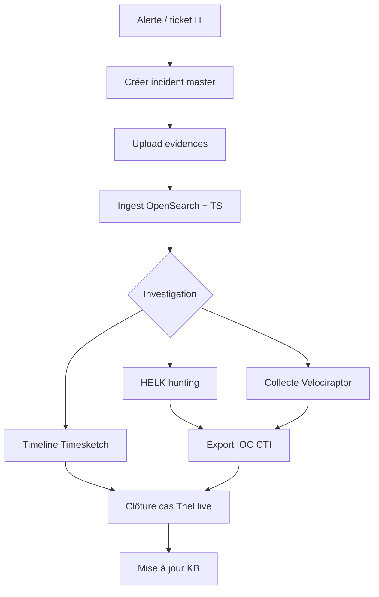

# IR — Incident Response

Gestion des incidents, tickets, base de connaissances et workflows dans le portail CERT, avec intégration TheHive et Cortex.

## Zones portail

| Zone UI | Route sidebar | API master |
|---------|---------------|------------|
| Incidents | Incidents | `/api/master/incidents` |
| Opérations CERT | Opérations CERT | Hub incidents + tokens |
| Tickets | (sous Opérations) | `/api/master/tickets` |
| Base de connaissances | Base de connaissances | `/api/master/kb` |
| Assets | Administration / master | `/api/master/assets` |
| Vulnérabilités | master | `/api/master/vulnerabilities` |

## Backend master

Fichier principal : [`portal-cert/lib/master-routes.js`](../../portal-cert/lib/master-routes.js).

### Indices OpenSearch

| Zone | Index |
|------|-------|
| Incidents | `forensic-portal-incidents` |
| Tickets | `forensic-portal-tickets` |
| KB | `forensic-portal-kb` |
| Assets | `forensic-portal-assets` |
| Vulnérabilités | `forensic-portal-vulnerabilities` |
| Notifications | `forensic-portal-notifications` |
| Workflows | `forensic-portal-workflows` |
| Users | `forensic-portal-users` |

### Endpoints CRUD

```
GET    /api/master/incidents
POST   /api/master/incidents
GET    /api/master/incidents/:id
PUT    /api/master/incidents/:id
DELETE /api/master/incidents/:id
GET    /api/master/incidents/:id/events
POST   /api/master/incidents/:id/events
```

Même pattern pour `tickets`, `kb`, `assets`, `vulnerabilities`, `workflows`.

### Dashboards master

| Route | Contenu |
|-------|---------|
| `GET /api/master/dashboard/cert` | Uploads, tokens, incidents, assets |
| `GET /api/master/dashboard/it` | Métriques portail IT |
| `GET /api/master/status` | État zones actives |
| `POST /api/master/seed` | Données démo lab |

## UI détail

| Fichier | Rôle |
|---------|------|
| `portal-shared/js/portal-master-zones.js` | Rendu zones master |
| `portal-shared/js/panel-incidents-detail.js` | Détail incident, events |
| `portal-shared/js/panel-kb-detail.js` | Articles KB |

## Workflow IR typique



## Intégration TheHive

| Action | Mécanisme |
|--------|-----------|
| Créer cas TheHive | Lien manuel depuis incident (observables) |
| Webhook retour | `POST /api/webhook/thehive` |
| Analyse observables | Cortex via TheHive |

Config : [`config/thehive/application.conf`](../../config/thehive/application.conf).

## Tokens IT → IR

1. Analyste CERT génère token (`POST /api/tokens/generate`)
2. Équipe IT dépose preuves via `/it/`
3. Incident master lié au `case_id` du token
4. Evidences disponibles dans **Ingestion & Evidences**

## Cas lab par défaut

- **CASE-001** — cas de démonstration hunting HELK + VR
- Seed : `POST /api/master/seed` ou scripts d'activation `forensic.sh`

## Audit

Journal d'activité : [`portal-cert/lib/audit-log.js`](../../portal-cert/lib/audit-log.js) — `GET /api/audit/*`.

Onglet portail : **Journal d'activité**.
