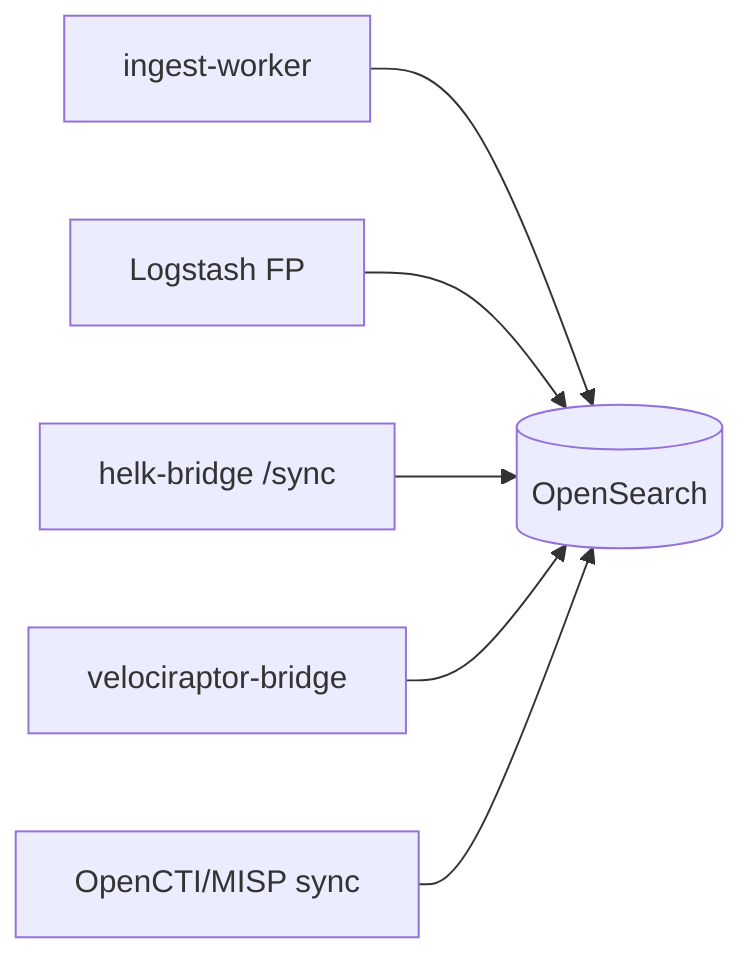

# OpenSearch — SIEM central

Moteur de recherche et stockage des logs forensic, métadonnées portail, findings HELK/VR et enrichissement CTI.

## Accès

| Interface | URL |
|-----------|-----|
| OpenSearch Dashboards | `https://<IP>/dashboards/` |
| API cluster | Interne `opensearch-node1:9200` |
| Alias historique | `/opensearch/` → redirect `/dashboards/` |

## Configuration

| Fichier | Rôle |
|---------|------|
| `config/opensearch/opensearch.yml` | Config nœuds |
| `config/opensearch/index-templates/forensic-template.json` | Template forensic-* |
| `config/opensearch/index-templates/fp-parsing-*.json` | Templates parsing |
| `config/opensearch/ism/` | Index State Management |
| `config/opensearch/dashboards/fp-platform-health.ndjson` | Dashboard santé OSD |

## Sources d'ingestion

| Source | Fichier worker / pipeline |
|--------|---------------------------|
| Upload portail | `ingest-worker/worker.py` |
| Logstash réseau | `config/logstash/pipeline/*.conf` |
| HELK sync | `helk_bridge.py` → indices `helk-findings`, `helk-detections` |
| VR export | `export_to_opensearch.py` |
| CTI IOC | `scripts/opensearch_ioc_misp_sync.py` |

## Indices principaux

| Pattern | Origine |
|---------|---------|
| `forensic-uploads*` | Métadonnées fichiers uploadés |
| `forensic-tokens*` | Tokens IT |
| `forensic-portal-*` | Master (incidents, KB…) |
| `fp-parsing-*` | Events parsés par type |
| `fp-ti-opencti-*` | Enrichissement OpenCTI |
| `fp-ti-misp-*` | IOC MISP |
| `helk-findings` | Sync HELK |
| `helk-detections` | Détections Sigma |
| `velociraptor-*` | Collections DFIR |

## Parsers ingest-worker

| Parser | Extensions |
|--------|------------|
| `evtx_parser.py` | `.evtx`, `.evt` |
| `text_parser.py` | `.log`, `.syslog`, `.txt` |
| `timesketch_csv.py` | CSV timeline 9 colonnes |
| `stix_parser.py` | STIX bundles |

## OpenSearch Dashboards

- Playbooks analyste : saved searches dans `config/opensearch/dashboards/`
- Import : scripts d'activation dans `forensic.sh` (phase activation layers)
- Pivot depuis portail : boutons **HELK (OpenSearch)** et requêtes host/IOC

## Logstash FP (non-HELK)

| Pipeline | Fichier |
|----------|---------|
| Inputs | `config/logstash/pipeline/00-inputs.conf` |
| Windows | `10-windows.conf` |
| Linux/macOS | `20-linux-macos.conf` |
| Multi-source | `40-multi-source.conf` |

Ports : Beats 5044, JSON 5045, syslog 5140, HEC 5555.

## Santé & métriques

- Portail : `GET /api/stats` — cumul documents cluster
- Grafana : datasource OpenSearch dans `config/grafana/provisioning/datasources/opensearch.yml`
- Vérification : `python3 scripts/global_health_dashboard_verify.py`
