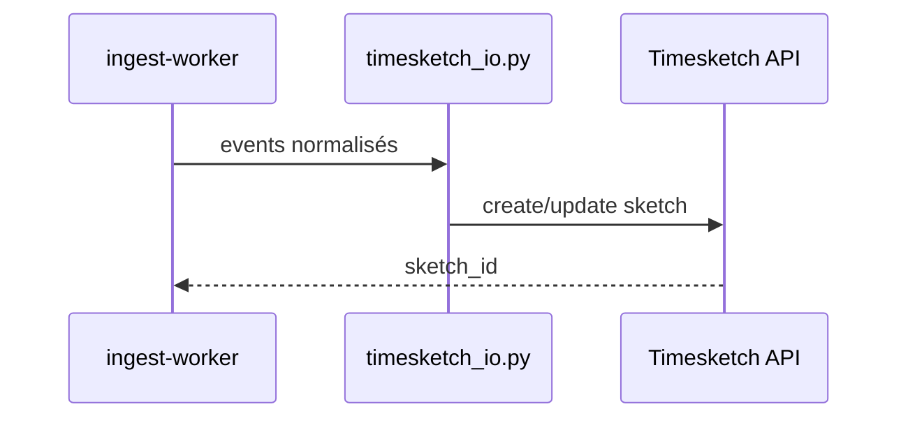

# Timesketch — Timelines forensic

Investigation chronologique des événements : import automatique depuis ingest, exports HELK et Velociraptor.

## Accès

| Interface | URL |
|-----------|-----|
| Timesketch Web | `https://<IP>/timesketch/` |
| API | `/api/v1/` (proxy nginx absolu) |
| Sketches | `/sketch/<id>` |

Nginx route les chemins absolus Vue (`/api/v1/`, `/sketch/`, `/login/`, `/dist/`) vers `timesketch-web:5000`.

## Configuration

| Fichier | Rôle |
|---------|------|
| `config/timesketch/timesketch.conf` | Config principale |
| `config/timesketch/sigma_config.yaml` | Intégration Sigma |
| `config/timesketch/data_finder.yaml` | Data finders |
| `config/timesketch/context_links.yaml` | Liens contexte |
| `config/timesketch/playbooks.json` | Playbooks analyste |
| `config/timesketch/zones/` | Zones géographiques |
| `config/timesketch/entrypoint-wrapper.sh` | Init conteneur |

## Import automatique (ingest-worker)



Fichiers :

- [`ingest-worker/timesketch_io.py`](../../ingest-worker/timesketch_io.py)
- [`ingest-worker/timesketch_pipeline.py`](../../ingest-worker/timesketch_pipeline.py)
- [`ingest-worker/parsers/timesketch_csv.py`](../../ingest-worker/parsers/timesketch_csv.py)

Format CSV attendu : 9 colonnes (datetime, message, timestamp_desc, …).

## Export depuis HELK

| Action portail | Route | Résultat |
|----------------|-------|----------|
| Export HELK timeline | `POST /api/helk/export-timesketch` | Sketch lié au `case_id` |

Bridge : `helk_bridge.py` → `/export/timesketch`.

## Export depuis Velociraptor

| Action portail | Route | Résultat |
|----------------|-------|----------|
| Créer timeline TS | `POST /api/velociraptor/export/timesketch` | Events collection → sketch |

Exporteur : [`velociraptor/export/export_to_timesketch.py`](../../velociraptor/export/export_to_timesketch.py).

## Pivot portail

Boutons **Timeline Timesketch** dans panneaux HELK et Velociraptor ouvrent `/timesketch/` avec le sketch associé au cas courant (`CASE-001` en lab).

## Services Docker

| Service | Rôle |
|---------|------|
| `timesketch-web` | UI + API |
| `timesketch-worker` | Tâches async |
| `timesketch-init` | Bootstrap données |

## Grafana

Dashboard Timesketch provisionné : `config/grafana/provisioning/dashboards/timesketch.yml`.

## Tests

```bash
cd tests && BASE_URL=https://<IP> npx playwright test ui-timesketch.spec.ts
```
